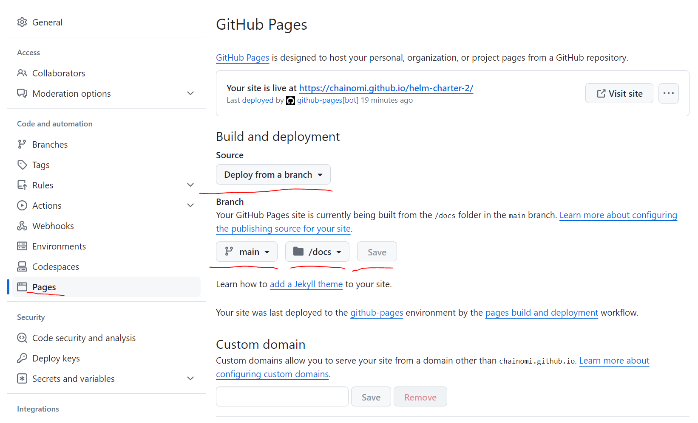

# Instructions

## Repo setup and Git hub actions setup
1. Create GH repo
2. Setup `GH_TOKEN` secret for actions to push artifacts to repo
3. Setup github pages as follows and click on save
   1. Source - Deploy from a branch
   2. Branch - main
   3. Folder - /docs 

1. Take note of the live site url - usually `https://<repo-owner>.github.io/<gh_repo_name>`
2. Add live site url as environment variable in github action e.g. repo_url

## Adding Helm repo
1. Add Helm repository - `helm repo add <gh_repo_name> https://<repo-owner>.github.io/<repo_name>`
2. View list of charts in repo - `helm search repo <gh_repo_name>`
3. View all versions of charts in a repo - `helm search repo <gh_repo_name> --versions`
4. View all versions of specific chart in a repo - `helm search repo <gh_repo_name>\<chart_name> --versions

# References
1. Helm official site - https://helm.sh/docs/topics/chart_repository/#github-pages-example
2. Example repo - https://github.com/technosophos/tscharts 